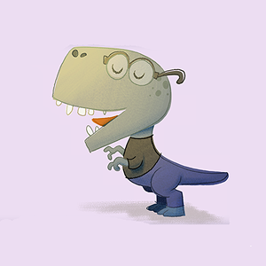

# Design System — Component Specifications
**Version:** 2.0.0
**Last Updated:** 2026-07-08
**Status:** Active — source of truth for all component build decisions

---

## How to Use This Document

This document defines every UI component in the system. Each entry specifies:
- **Anatomy** — every element that makes up the component
- **Component tokens** — scoped CSS variables that map to semantic tokens. Use these, not the semantic tokens directly, when styling the component
- **All states** — default, hover, focus, active, disabled, and any component-specific states
- **Accessibility spec** — ARIA attributes, keyboard behaviour, screen reader output
- **Interaction spec** — what happens on each user action
- **Responsive behaviour** — how the component changes at each breakpoint
- **Figma component name** — the exact name in the Figma file this maps to
- **CSS class name** — the exact class name used in HTML and CSS

Rules for Claude Code:
- Read the component entry in full before writing any code
- Use component tokens, not semantic tokens, in component CSS
- All states must be implemented — not just default
- Figma component name and CSS class name must match exactly
- Never invent values — if a value is not in this document or DESIGN-SYSTEM.md, raise it as a question before proceeding

---

## Component Index

1. Button
2. Tag
2b. Tag-Chip
2c. Filter Drawer
3. Card
4. Navigation — Desktop
5. Navigation — Mobile Tab Bar
6. Tooltip
7. Toast Notification
8. Breadcrumb
9. Divider
10. Blockquote
11. Code Block
12. Back to Top Button
13. Share Button
14. Standard Page Template

---

## 1. Button

**Figma Component Name:** `Button`
**CSS Class:** `.btn`
**HTML Element:** `<button>` or `<a>` when linking

### Design Intent
Buttons are the primary interactive call-to-action element. They communicate the outcome of an action. Label text always describes what will happen — never generic labels like "Click here" or "Submit". Short labels use `.sr-only` hidden context for screen readers when the visible label alone is ambiguous.

### When to Use
- Triggering an action (copy to clipboard, submit, navigate)
- Primary CTA at the end of a card or section

### When NOT to Use
- Navigating between pages where an `<a>` tag is more semantically correct
- As a decorative element with no action

### Variants

| Variant | Class | Usage |
|---|---|---|
| Primary | `.btn` | Default — main CTA, filled background |
| Ghost | `.btn--ghost` | Secondary — outline only, no fill |
| Icon + Label | `.btn--icon` | Button with a Tabler icon left of label |

### Component Tokens

```css
--btn-bg:               var(--color-background-subtle);
--btn-bg-hover:         var(--color-border-strong);
--btn-bg-active:        var(--color-border-default);
--btn-border:           var(--color-border-strong);
--btn-border-hover:     var(--color-interactive-hover);
--btn-border-focus:     var(--color-interactive-focus);
--btn-text:             var(--color-text-primary);
--btn-text-hover:       var(--color-interactive-default);
--btn-text-disabled:    var(--color-text-disabled);
--btn-padding-x:        var(--space-5);
--btn-padding-y:        var(--space-3);
--btn-font-size:        var(--font-size-sm);
--btn-font-weight:      var(--font-weight-medium);
--btn-letter-spacing:   var(--letter-spacing-wide);
--btn-radius:           var(--border-radius-sm);
--btn-transition:       var(--duration-fast) var(--ease-out);
--btn-min-height:       44px;

/* Ghost variant overrides */
--btn-ghost-bg:         transparent;
--btn-ghost-border:     var(--color-border-strong);
--btn-ghost-text:       var(--color-text-primary);
```

### Anatomy

```
[ Icon? ] [ Label ] [ .sr-only context? ]
```

- Container: `<button class="btn">` or `<a class="btn">`
- Optional icon: `<i class="ti ti-{name}" aria-hidden="true"></i>`
- Label: visible text
- Optional screen reader context: `<span class="sr-only">{additional context}</span>`

### States

| State | Background | Border | Text | Transition |
|---|---|---|---|---|
| Default | `--btn-bg` | `--btn-border` | `--btn-text` | — |
| Hover | `--btn-bg-hover` | `--btn-border-hover` | `--btn-text-hover` | `--btn-transition` |
| Focus | `--btn-bg` | `--btn-border-focus` | `--btn-text` | Focus ring appears |
| Active | `--btn-bg-active` | `--btn-border` | `--btn-text` | — |
| Disabled | `--btn-bg` | `--btn-border` | `--btn-text-disabled` | None |

Focus ring: `2px solid var(--color-interactive-focus)`, offset `3px` — inherited from global `:focus-visible`.

Disabled: add `disabled` attribute on `<button>`. Add `aria-disabled="true"` and `tabindex="-1"` on `<a>` elements used as buttons.

### Accessibility

- Must have a descriptive label — visible text or `aria-label`
- If icon only: `aria-label` required on the button, icon gets `aria-hidden="true"`
- If short label with hidden context: use `.sr-only` span inside button
- Screen reader output: "{label} {sr-only context}, button"
- Keyboard: `Enter` and `Space` activate. `Tab` to focus.

### Responsive Behaviour

- Min height `44px` at all breakpoints — touch target requirement
- Full width on mobile when used as primary CTA in a card: add `.btn--full` modifier

---

## 2. Tag

**Figma Component Name:** `Tag`
**CSS Class:** `.tag`
**HTML Element:** `<a href="archive.html?tag={slug}" class="tag">`

### Design Intent
Tags are interactive navigation links. Clicking a tag navigates to `archive.html?tag={slug}` — a filtered view of all Work and Thoughts entries matching that tag. The slug is the tag label converted to lowercase with spaces replaced by hyphens.

Tags sit above `.card-block-link` via `.card-tags { position: relative; z-index: 3 }`. Inside clickable cards, individual tag clicks are independent of the card click — a tag click navigates to the archive, a card click navigates to the entry.

### When to Use
- Categorising Work entries and Thoughts entries
- Displaying skill labels in the Profile card

### When NOT to Use
- As non-interactive labels — tags are always links in this system

### Variants

Single variant only — `.tag`. No `.tag--secondary`.

### Component Tokens

```css
--tag-border:                var(--color-accent-primary);
--tag-border-hover:          var(--color-accent-primary);
--tag-text:                  var(--color-accent-primary);
--tag-text-hover:            var(--color-accent-primary);
--tag-bg:                    transparent;
--tag-bg-hover:              var(--color-background-subtle);
--tag-padding-x:             var(--space-3);
--tag-padding-y:             var(--space-1);
--tag-font-size:             var(--font-size-sm);
--tag-font-weight:           var(--font-weight-regular);
--tag-font-weight-hover:     var(--font-weight-bold);
--tag-letter-spacing:        var(--letter-spacing-wide);
--tag-radius:                var(--border-radius-lg);
--tag-transition:            var(--duration-fast) var(--ease-out);
```

### Anatomy

```
[ Label text ]
```

- Container: `<a href="archive.html?tag={slug}" class="tag">{Label}</a>`
- No icons inside tags
- Slug format: tag label converted to lowercase with hyphens — "User Experience" → `user-experience`

### States

| State | Background | Border | Text | Font-Weight |
|---|---|---|---|---|
| Default | `transparent` | `--color-accent-primary` | `--color-accent-primary` | `regular` |
| Hover | `--color-background-subtle` | `--color-accent-primary` | `--color-accent-primary` | `bold` |
| Focus | `transparent` | `--color-accent-primary` | `--color-accent-primary` + focus ring | `regular` |

### Accessibility

- Tags are interactive links — no `aria-hidden`
- Screen reader announces: "{Tag label}. Link."
- Keyboard: Tab to focus, Enter to navigate to archive
- Focus ring: `2px solid var(--color-interactive-focus)`, offset `3px`

### Responsive Behaviour

- Same size at all breakpoints
- Tags wrap to new line when they exceed container width — never truncate
- Gap between tags: `var(--space-2)`

---

## 2b. Tag-Chip

**Figma Component Name:** `Tag-Chip`
**CSS Class:** `.tag-chip`
**HTML Element:** `<button class="tag-chip" type="button" data-filter="{slug}" aria-pressed="false">`

### Design Intent
Tag-Chips are interactive filter controls used in the Archive Header and Filter Drawer. Unlike Tag links (which navigate to a new page), Tag-Chips toggle filter state in place with no page reload. They follow a 4-state model: Default, Hover, Active (filter applied), and Dim (available while another filter is active).

### When to Use
- Inside `.archive-inline-filters` on desktop
- Inside `.filter-drawer-body` on tablet/mobile (Filter Drawer)

### When NOT to Use
- As navigation links — use `.tag` instead
- As non-interactive labels

### Variants

| Modifier | Purpose |
|---|---|
| (none) | Default — filter not applied |
| `.tag-chip--active` | Filter is currently applied |
| `.tag-chip--dim` | Available, but another filter is active |

### Component Tokens

```css
/* Default */
--chip-border:             var(--border-width-thin) solid var(--color-accent-primary);
--chip-bg:                 transparent;
--chip-text:               var(--color-accent-primary);
--chip-font-weight:        var(--font-weight-regular);

/* Hover */
--chip-bg-hover:           var(--color-background-subtle);
--chip-font-weight-hover:  var(--font-weight-bold);

/* Active */
--chip-border-active:      var(--border-width-medium) solid var(--color-accent-primary-text);
--chip-bg-active:          var(--color-background-surface);
--chip-text-active:        var(--color-accent-primary-text);
--chip-font-weight-active: var(--font-weight-bold);

/* Dim */
--chip-border-dim:         var(--border-width-thin) solid var(--color-border-strong);
--chip-bg-dim:             var(--color-background-subtle);
--chip-text-dim:           var(--color-text-disabled);
```

### Anatomy

```
[ Label text ]        ← default / hover / dim
[ Label text  × ]     ← active (× is .tag-chip-x, aria-hidden)
```

- Container: `<button class="tag-chip" type="button" data-filter="{slug}" aria-pressed="false">`
- X indicator (active only): `<span class="tag-chip-x" aria-hidden="true">×</span>` inside button
- `data-filter`: slug matching `[data-tags]` attribute on archive items
- `aria-pressed`: `"true"` when active, `"false"` otherwise — managed by `initArchiveFilter()`

### States

| State | Background | Border | Text | Font-Weight |
|---|---|---|---|---|
| Default | `transparent` | `thin` + `--color-accent-primary` | `--color-accent-primary` | `regular` |
| Hover | `--color-background-subtle` | `thin` + `--color-accent-primary` | `--color-accent-primary` | `bold` |
| Active | `--color-background-surface` | `medium` + `--color-accent-primary-text` | `--color-accent-primary-text` | `bold` |
| Dim | `--color-background-subtle` | `thin` + `--color-border-strong` | `--color-text-disabled` | `regular` |

### Accessibility

- `type="button"` prevents form submission
- `aria-pressed` managed by JS — `"true"` when active, `"false"` otherwise
- When active: `aria-label="Remove {Label} filter"` set by JS to describe the removal action
- `.tag-chip-x`: `aria-hidden="true"` — decorative; the button's accessible label covers it
- Focus ring: `2px solid var(--color-interactive-focus)`, offset `3px`
- Screen reader (default): "{Label}. Button."
- Screen reader (active): "Remove {Label} filter. Button."

### Responsive Behaviour

- On desktop: appears in `.archive-inline-filters` (inline in archive header)
- On tablet/mobile: appears in `.filter-drawer-body` (inside Filter Drawer)
- State syncs between both locations via shared `activeFilters` set in `initArchiveFilter()`

### JavaScript API

Chips are wired by `initArchiveFilter()` in `script.js`. Each chip must have `data-filter` matching the slugs in `[data-tags]` on archive items.

Default chip:
```html
<button class="tag-chip" type="button" data-filter="quality-assurance" aria-pressed="false">
    Quality Assurance
</button>
```

Active state (set by JS, not authored manually):
```html
<button class="tag-chip tag-chip--active" type="button" data-filter="quality-assurance"
        aria-pressed="true" aria-label="Remove Quality Assurance filter">
    Quality Assurance
    <span class="tag-chip-x" aria-hidden="true">×</span>
</button>
```

---

## 2c. Filter Drawer

**CSS Classes:** `.filter-drawer`, `.filter-drawer-trigger`, `.action-rail-group`, `.action-rail-trigger`, `.archive-scrim`, `.archive-inline-filters`, `.archive-sort-count-row`, `.chip-count`
**JS Functions:** `initFilterDrawer()`, `initArchive()`, `trapFocus()` in `script.js`

### Design Intent
Two distinct filter access modes exist, governed by a single IntersectionObserver on `#archive-header-sentinel`:

**Desktop — header uncondensed (sentinel in viewport, top of page):** Row 1 of the header shows a Clear button (left) and search input (fills remaining width) — no sort toggle, no Filters trigger at this position. Below that, Row 2 shows primary type chips (Work, Thoughts) with entry-count badges; Row 3 shows secondary tag chips with entry-count badges.

**Desktop — header condensed (sentinel left viewport, user scrolled):** The inline chips section is hidden. The floating action rail group (`.action-rail-group`) appears at the right viewport edge with the floating "Filters" trigger. The header has scrolled away, so the inline area is no longer in view regardless.

**Tablet / Mobile — all scroll positions:** The `.archive-inline-filters` container is always hidden. The header row shows Clear + search + Filters trigger. The drawer is the exclusive filter mechanism at these breakpoints.

**All breakpoints — between header and results:** A `.archive-sort-count-row` shows the sort toggle (left) and entry count (right), positioned between the archive header and the results grid. This row is visible at all breakpoints.

The drawer is a unified bottom-sheet. Its first row mirrors the header controls: Clear (left), search input, Filters/Close trigger (right). Rows 2 and 3 show primary and secondary chips with count badges. Closing happens via the drawer's own trigger (labelled "Close" when open), the scrim, or Escape.

### When to Use
- On any page with filterable archive content

### HTML Structure

```html
<!-- Archive header -->
<div class="archive-sticky-header" id="archive-sticky-header">
    <div class="container">

        <!-- Controls row:
             Desktop (uncondensed): Clear (left) + Search (fills width). Filters trigger hidden via CSS.
             Mobile/tablet: Clear + Search + Filters trigger (always visible). -->
        <div class="archive-controls-row">
            <button class="archive-clear-btn btn btn--ghost" type="button" disabled>Clear</button>
            <label for="archive-search" class="sr-only">Search entries</label>
            <input type="search" class="archive-search-input" id="archive-search"
                   placeholder="Search" autocomplete="off">
            <button class="filter-drawer-trigger" type="button"
                    aria-expanded="false"
                    aria-controls="filter-drawer"
                    aria-haspopup="dialog">
                <span class="trigger-label">Filters</span>
                <span class="action-rail-badge" aria-hidden="true" hidden>0</span>
            </button>
        </div>

        <!-- Inline chips — desktop only, uncondensed state only -->
        <div class="archive-inline-filters" id="archive-inline-filters">
            <div class="archive-primary-chips" role="group" aria-label="Filter by type">
                <button class="tag-chip" type="button" data-filter-type="work" aria-pressed="false">Work<span class="chip-count" aria-hidden="true"></span></button>
                <button class="tag-chip" type="button" data-filter-type="thoughts" aria-pressed="false">Thoughts<span class="chip-count" aria-hidden="true"></span></button>
            </div>
            <div class="archive-active-chips" id="archive-active-chips"></div>
            <div id="archive-secondary-chips" aria-label="Filter by tag"></div>
        </div>

    </div>
</div>

<!-- Sentinel — IntersectionObserver fires when this leaves/re-enters viewport -->
<div id="archive-header-sentinel" aria-hidden="true"></div>

<!-- Floating action rail group — visible only when sentinel has left viewport -->
<div class="action-rail-group" id="action-rail-group">
    <button class="action-rail-trigger" type="button"
            aria-controls="filter-drawer"
            aria-haspopup="dialog"
            aria-expanded="false"
            aria-label="Open filters">
        <span class="trigger-label">Filters</span>
        <span class="action-rail-badge" aria-hidden="true" hidden>0</span>
    </button>
</div>

<!-- Scrim — semi-transparent backdrop; click closes drawer -->
<div class="archive-scrim" id="archive-scrim" aria-hidden="true" hidden></div>

<!-- Filter drawer — unified bottom sheet; starts hidden -->
<div class="filter-drawer" id="filter-drawer"
     role="dialog" aria-modal="true" aria-label="Search and filter"
     hidden>
    <div class="filter-drawer-body">

        <!-- Row 1: Clear (left) · Search (fills width) · Filters/Close trigger (right) -->
        <div class="filter-drawer-controls">
            <button class="archive-clear-btn btn btn--ghost" type="button" disabled>Clear</button>
            <label for="drawer-search" class="sr-only">Search entries</label>
            <input type="search" class="archive-search-input" id="drawer-search"
                   placeholder="Search" autocomplete="off">
            <button class="filter-drawer-trigger" type="button"
                    aria-expanded="false"
                    aria-controls="filter-drawer"
                    aria-haspopup="dialog">
                <span class="trigger-label">Filters</span>
            </button>
        </div>

        <!-- Row 2: Primary type chips with count badges -->
        <div class="filter-drawer-primary-chips" role="group" aria-label="Filter by type">
            <button class="tag-chip" type="button" data-filter-type="work" aria-pressed="false">Work<span class="chip-count" aria-hidden="true"></span></button>
            <button class="tag-chip" type="button" data-filter-type="thoughts" aria-pressed="false">Thoughts<span class="chip-count" aria-hidden="true"></span></button>
        </div>

        <!-- Row 3: Secondary tag chips populated by initArchive() -->
        <div id="filter-drawer-chips"></div>

    </div>
</div>

<!-- Sort toggle (left) + entry count (right) — between archive header and results grid -->
<div class="archive-sort-count-row">
    <button class="archive-sort-toggle" type="button">Latest ↑</button>
    <p class="archive-count" id="archive-count" aria-live="polite">Loading…</p>
</div>
```

**Notes:**
- The `.trigger-label` span isolates the dynamic text ("Filters" ↔ "Close") from the badge span so JS can update the label without disturbing other content.
- `.archive-sticky-header` receives `.is-condensed` from the IntersectionObserver callback. CSS uses `:not(.is-condensed)` to show inline chips and hide the Filters trigger on desktop.
- Both `.filter-drawer-trigger` (header) and `.action-rail-trigger` (floating) carry an `.action-rail-badge` span. Both badges are updated from the same `filterCount` in the same `render()` pass, ensuring badge parity at all times.
- Chip-count badges (`.chip-count`) on each chip show how many entries match that filter given the current query and other active filters, updating on every render.

### Archive Item Markup

Filterable items need `data-tags` (comma-separated slugs) and a `data-searchable` heading:

```html
<article class="card" data-tags="quality-assurance,user-experience">
    <div class="card-content">
        <h2 data-searchable>Post Title</h2>
    </div>
</article>
```

### Behaviour

| Trigger | Result |
|---|---|
| Click "Filters" (header/rail trigger, closed) | Drawer slides up; scrim fades in; trigger label becomes "Close"; focus moves to first focusable element in drawer; all page content outside drawer becomes `inert` |
| Click "Close" (any trigger, open) | Drawer slides down; scrim fades out; `inert` removed from page content; focus returns to the trigger that opened the drawer |
| Click scrim | Same as clicking "Close" |
| Escape key | Drawer closes; same cleanup as "Close" |
| Tab / Shift+Tab with drawer open | Focus stays within drawer — browser enforces this via `inert` on all outside elements; `trapFocus()` provides belt-and-suspenders wrapping |
| Click inline chip (desktop, uncondensed) | Toggles filter; state syncs across inline chips and drawer chips |
| Click chip in drawer | Toggles filter; state syncs across drawer chips and inline chips |
| Badge count | Updates simultaneously on `.filter-drawer-trigger` and `.action-rail-trigger` from same `filterCount` on each render pass |
| Clear button (enabled) | Clears all active type and secondary tag filters; search text cleared; sort reset to Latest; button self-disables |
| Clear button (disabled) | `disabled` attribute set when `filterCount === 0`; search text alone does not count as a filter |
| Sort toggle | Toggles Latest ↑ / Earliest ↓; located in `.archive-sort-count-row` outside the header and drawer |
| Chip count badge | Each chip shows entry count matching that filter within current query and other active filters; updates on every render |
| Type in search | Debounced 250ms; filters by `data-searchable` text; updates chip counts |

### Accessibility

- All trigger buttons: `aria-expanded` updated by JS; `aria-controls="filter-drawer"`; `aria-haspopup="dialog"`
- `.action-rail-trigger`: `aria-label` updated dynamically ("Open filters" / "Close filters")
- Clear button: `disabled` attribute toggled by JS — screen readers announce "dimmed" state; removed from tab order when disabled
- Scrim: `aria-hidden="true"` — decorative; close affordance is the trigger button and Escape key
- Drawer: `role="dialog"` + `aria-modal="true"` + `aria-label="Search and filter"`
- Focus containment: `inert` applied to all page content outside the drawer while open (prevents Tab from reaching duplicate controls in header, main content, nav, or footer); `trapFocus()` wraps focus at drawer boundary as belt-and-suspenders
- Return focus: whichever trigger opened the drawer receives focus on close; `inert` removed before focus return
- Chip count badges: `.chip-count` spans are `aria-hidden="true"` — counts are supplementary; button labels carry the semantic meaning
- Keyboard: Escape closes from any position inside drawer

### Responsive Behaviour

| Context | Inline chips (`.archive-inline-filters`) | Header trigger (`.filter-drawer-trigger`) | Rail group (`.action-rail-group`) | Sort + count row | Drawer access |
|---|---|---|---|---|---|
| Desktop — uncondensed (top of page) | Visible (with chip counts) | Hidden | Hidden | Visible (always) | Not available — inline chips used |
| Desktop — condensed (scrolled) | Hidden | Hidden (header scrolled away) | Visible | Visible (always) | Via rail trigger |
| Tablet / Mobile — any scroll position | Hidden | Visible (with badge) | Hidden | Visible (always) | Via header trigger |

The transition between "uncondensed" and "condensed" on desktop is governed by the IntersectionObserver on `#archive-header-sentinel`. While the filter drawer is open, `.is-condensed` state on `.archive-sticky-header` is locked — the observer skips state changes if `.filter-drawer--open` is present in the DOM. After the drawer closes, condensed state is re-evaluated on the user's next scroll action.

### Z-Index Layering

| Layer | z-index |
|---|---|
| Tab bar | 200 |
| Scrim (`.archive-scrim`) | 249 |
| Drawer (`.filter-drawer`) | 250 |
| Rail group (`.action-rail-group`) | 260 |
| Toast | 300 |

### Dependencies

- `trapFocus()` — reusable utility in `script.js`
- `.tag-chip` — See `## 2b. Tag-Chip`
- `IntersectionObserver` on `#archive-header-sentinel` — toggles `.action-rail-group--visible` on the rail group and `.is-condensed` on `.archive-sticky-header`; guarded against drawer-open state; scroll re-arm fires after drawer close
- `inert` HTML attribute — applied to all page content outside the drawer on open; removed on close before focus return

---

## 3. Card

**Figma Component Name:** `Card/Work`
**CSS Base Class:** `.card`
**HTML Element:** `<article class="card card--{variant}">`

### Design Intent
Cards are the primary content presentation unit. The entire card is clickable via the IxDF block link pattern — an absolutely positioned anchor (`card-block-link`) covers the full card for mouse users, while the CTA anchor (`card-cta`) is the sole keyboard-focusable element with a full, descriptive `aria-label`. This gives mouse users click-anywhere convenience and keyboard users a clean, descriptive tab stop.

### Variants

| Variant | Modifier | Figma Style | Usage |
|---|---|---|---|
| Feature | `.card--feature` | `Style=Feature` | Work / portfolio cards on Home and Work index |
| Thought | `.card--thought` | `Style=Thought` | Blog / writing entries on Home and Thoughts index |
| Profile | `.card--profile` | `Style=Profile` | Profile card in left column on Home page |

### Block Link Pattern (Feature and Thought variants only)

The `.card-block-link` is an absolutely positioned empty anchor that covers the full card. It is `aria-hidden="true"` and `tabindex="-1"` — invisible to assistive technology and not keyboard focusable. Mouse users click anywhere on the card to navigate. The `.card-cta` anchor sits above the block link (`z-index: 2`) and is the only keyboard-accessible interactive element. It carries the full descriptive `aria-label`.

```
z-index stack (card has position: relative):
  .card-cta            z-index: var(--card-cta-z)       ← keyboard focus lands here
  .card-block-link     z-index: var(--card-block-link-z) ← intercepts mouse clicks on card body
  card content         z-index: auto                     ← visible but not pointer-interactive
```

### Component Tokens

```css
--card-bg:              var(--color-background-surface);
--card-border:          var(--color-border-default);
--card-radius:          var(--border-radius-md);
--card-image-bg:        var(--color-background-subtle);
--card-image-ratio:     16 / 9;
--card-transition:      var(--duration-base) var(--ease-out);
--card-block-link-z:    1;
--card-cta-z:           2;

/* Card CTA button — inherits from Button component tokens */
--card-cta-bg:          var(--btn-bg);
--card-cta-border:      var(--btn-border);
--card-cta-text:        var(--btn-text);
--card-cta-radius:      var(--btn-radius);
--card-cta-padding-x:   var(--btn-padding-x);
--card-cta-padding-y:   var(--btn-padding-y);
```

`.card-content` padding is `var(--space-3) var(--space-6)` (12px top/bottom, 24px left/right) — set directly on `.card-content`, not via the `--card-padding` custom property (which still exists for `.card-image-caption`'s use in the Profile variant, unaffected by this).

Feature-variant desktop/tablet horizontal layout uses `--card-image-column-width` (`42%`) — see §4.5 of `DESIGN-SYSTEM.md`, since it's a global `:root` token rather than scoped to `.card`.

### States

| State | Card Border | Card Background | Box Shadow | Transition |
|---|---|---|---|---|
| Default | `--card-border` | `--card-bg` | none | — |
| Hover | `var(--color-accent-primary-text)` (teal) | `--card-bg` | `0 var(--space-1) 0 var(--color-accent-primary)` — solid, non-blurred | `--card-transition` |
| Focus (keyboard) | Focus ring on `.card-cta` | `--card-bg` | none | Focus ring appears |

Hover applies to the whole card — including the image column on Feature cards at tablet/desktop width. The image has no border of its own; it's flush against the card's inner edge, so it's already visually wrapped by the same border with no separate rule needed.

---

### Variant: Feature (Card/Feature)

**CSS Class:** `.card.card--feature`
**Usage:** Work / portfolio cards

Content order (both Feature and Thought): **Title → Tags → Meta → Excerpt → CTA**. This was reordered from the earlier Title → Excerpt → Tags → Meta → CTA — validated on `card-variants-preview.html`'s "Final Candidate" before being promoted into this live component.

#### Anatomy

```
[ .card-block-link — empty, aria-hidden, tabindex=-1 ]
[ .card-image — 16:9 decorative background, no fixed height ]
[ .card-content ]
  [ h3.card-title ]
  [ .card-tags ]
    [ .tag ]
  [ p.card-meta — {date} · {author} ]
  [ p.card-excerpt — 2-line clamp, full text in DOM ]
  [ a.card-cta ]
```

```html
<article class="card card--feature">
    <a href="{url}" class="card-block-link" aria-hidden="true" tabindex="-1"></a>
    <div class="card-image" role="presentation"></div>
    <div class="card-content">
        <h3 class="card-title">{Title}</h3>
        <div class="card-tags">
            <a href="/archive.html?tag={slug}" class="tag">{Tag}</a>
        </div>
        <p class="card-meta">{date} · {author}</p>
        <p class="card-excerpt">{Description}</p>
        <a href="{url}" class="card-cta" aria-label="{Title} — view this project">View</a>
    </div>
</article>
```

#### Accessibility

- `<article>` announces as a landmark to screen readers
- `.card-block-link` is `aria-hidden="true"` and `tabindex="-1"` — skipped entirely by keyboard and AT; it's a sibling of `.card-content`, never a wrapper around it
- `.card-cta` is the sole focusable element (besides tags) — carries full `aria-label`
- Tags are real `<a href="/archive.html?tag={slug}">` links — no `aria-hidden`, no `tabindex` override — independently focusable and clickable, verified via real Tab-key navigation and hit-testing
- Screen reader output: "Article. {Title}, heading level 3. {Tag}, link. ... View, link." (CTA aria-label: "{Title} — view this project")
- Image: CSS background — no alt text needed
- `.card-excerpt` visually clamps to 2 lines (`-webkit-line-clamp: 2`) but the full text remains in the DOM and is exposed in the accessibility tree — confirmed via a real accessibility-tree snapshot, not just source inspection

#### Responsive Behaviour

| Breakpoint | Layout | Image | Content |
|---|---|---|---|
| Below 768px | Stacked (default block flow — no extra CSS needed) | Full width, `aspect-ratio: 16/9` | Below image |
| 768px and above (tablet + desktop) | `display: flex; flex-direction: row` | Left column, `width: var(--card-image-column-width)` (42%), `aspect-ratio: auto` | `flex: 1`, right of image |

The image has no fixed height at either breakpoint. At 768px+, `align-items: stretch` on `.card--feature` makes the image match whatever height `.card-content` naturally reaches for its real text — verified against both a long-excerpt and a short-excerpt real entry, image height matched content height exactly (0px difference) in both cases. The card itself never exceeds the page's existing content-column width, since it fills its parent grid cell (`.card-row`, `.container`), which is already `max-width`-capped.

---

### Variant: Thought (Card/Thought)

**CSS Class:** `.card.card--thought`
**Usage:** Blog / writing entries. No thumbnail image — content only, at every breakpoint.

Same content order, padding, and hover treatment as Feature — see above. `.card--thought .card-image { display: none; }` remains as a safety net, but in practice no `.card-image` element is ever rendered for Thought entries (`buildCard()` only builds the image div when `entry.type === 'work'`), so the horizontal-layout media query (scoped to `.card--feature`) never applies here regardless of viewport width.

#### Anatomy

```
[ .card-block-link — empty, aria-hidden, tabindex=-1 ]
[ .card-content ]
  [ h3.card-title ]
  [ .card-tags ]
    [ .tag ]
  [ p.card-meta — Published {date} · {author} ]
  [ p.card-excerpt — 2-line clamp, full text in DOM ]
  [ a.card-cta ]
```

```html
<article class="card card--thought">
    <a href="{url}" class="card-block-link" aria-hidden="true" tabindex="-1"></a>
    <div class="card-content">
        <h3 class="card-title">{Title}</h3>
        <div class="card-tags">
            <a href="/archive.html?tag={slug}" class="tag">{Tag}</a>
        </div>
        <p class="card-meta">Published {date} · {author}</p>
        <p class="card-excerpt">{Summary}</p>
        <a href="{url}" class="card-cta" aria-label="{Title} — read this thought">Read</a>
    </div>
</article>
```

#### Accessibility

- `.card-cta` `aria-label` action: "read this thought"
- Screen reader output: "Article. {Title}, heading level 3. ... Read, link." (with aria-label: "{Title} — read this thought")
- Same tag/excerpt accessibility notes as Feature, above

---

### Variant: Profile (Card/Profile)

**CSS Class:** `.card.card--profile`
**Usage:** Profile card in the left column of the Home page. Desktop: sticky. Mobile: static, appears first in source order.

The Profile variant does not use the block link / CTA pattern. It has multiple action buttons (LinkedIn, About) and is not a single-destination card.

#### Anatomy

```
[ .card-image — illustration, full width ]
[ p.card-image-caption ]
[ .card-content ]
  [ h2.card-profile-name ]
  [ .card-tags ]
    [ .tag ]
  [ p bio ]
  [ .card-profile-actions ]
    [ a.btn — LinkedIn ]
    [ a.btn--ghost — About ]
```

```html
<article class="card card--profile">
    <div class="card-image">
        
    </div>
    <p class="card-image-caption">{Caption}</p>
    <div class="card-content">
        <h2 class="card-profile-name">{Name}</h2>
        <div class="card-tags">
            <span class="tag" aria-hidden="true">{Skill}</span>
            <span class="tag" aria-hidden="true">{Skill}</span>
        </div>
        <p>{Bio}</p>
        <div class="card-profile-actions">
            <a href="{linkedin-url}" class="btn">Connect on LinkedIn</a>
            <a href="about.html" class="btn btn--ghost">Read More about Chris<span class="sr-only"> on the About page</span></a>
        </div>
    </div>
</article>
```

#### Component Tokens (Profile-specific)

```css
--card-profile-name-size:       var(--font-size-2xl);
--card-profile-name-weight:     var(--font-weight-bold);
--card-profile-caption-size:    var(--font-size-xs);
--card-profile-caption-color:   var(--color-text-secondary);
--card-profile-sticky-top:      80px;
```

#### States

- Desktop: `position: sticky; top: var(--card-profile-sticky-top)`
- Mobile: `position: static`

#### Accessibility

- `<article>` announces as a landmark
- Illustration: `alt=""` and `aria-hidden="true"` — decorative
- "Read More about Chris" has `.sr-only` context: "on the About page"
- LinkedIn button is a standard `<a>` — opens in same tab by default

#### Responsive Behaviour

| Breakpoint | Layout | Image Column | Content Column |
|---|---|---|---|
| Desktop 1024px+ | Two column — Auto left, Fill right | 348px auto width, full height, object-fit cover | Fills remaining space, 24px padding, flex column |
| Tablet 768px–1023px | Two column — Auto left, Fill right | 220px auto width, full height, object-fit cover | Fills remaining space, 20px padding, flex column |
| Mobile below 768px | Single column stacked | Max 300px, centred, 16px top padding | Full width below image |

---

## 4. Navigation — Desktop

**Figma Component Name:** `Nav/Desktop`
**CSS Class:** `.site-nav`
**HTML Element:** `<header><nav class="site-nav" aria-label="Main navigation">`

### Design Intent
The desktop nav is the persistent wayfinding element. Logo/name is centred above the nav links. It stays sticky at the top so users always have access to navigation without scrolling back up.

### Component Tokens

```css
--nav-bg:               var(--color-background-base);
--nav-border:           var(--color-border-default);
--nav-height:           64px;
--nav-logo-size:        var(--font-size-base);
--nav-logo-weight:      var(--font-weight-bold);
--nav-link-size:        var(--font-size-sm);
--nav-link-weight:      var(--font-weight-medium);
--nav-link-spacing:     var(--letter-spacing-widest);
--nav-link-color:       var(--color-text-secondary);
--nav-link-hover:       var(--color-text-primary);
--nav-link-active:      var(--color-text-primary);
--nav-link-gap:         var(--space-8);
--nav-transition:       var(--duration-fast) var(--ease-out);
```

### Anatomy

```
[ .nav-logo "Christopher Klein" centred ]
[ .nav-links centred below logo ]
  [ a Home ] [ a Work ] [ a Thoughts ] [ a About ]
```

- Container: `<nav class="site-nav" aria-label="Main navigation">`
- Logo: `<a href="index.html" class="nav-logo">Christopher Klein</a>` — centred, `--nav-logo-size`, `--nav-logo-weight`
- Links wrapper: `<ul class="nav-links" role="list">` — centred below logo
- Each link: `<li><a href="{page}.html">{Label}</a></li>`
- Active link: `aria-current="page"` set dynamically via `script.js` after nav injection

### Active State

Active nav link:
- Text colour: `--nav-link-active` (white)
- Text decoration: underline, `2px` offset
- Set via: `[aria-current="page"]` CSS selector

### States

| State | Colour | Decoration |
|---|---|---|
| Default | `--nav-link-color` | None |
| Hover | `--nav-link-hover` | None |
| Focus | `--nav-link-hover` | Focus ring |
| Active (current page) | `--nav-link-active` | Underline |

### Accessibility

- `aria-label="Main navigation"` on `<nav>`
- `aria-current="page"` on the active link — set by `script.js`
- Skip link before nav: `<a href="#main-content" class="skip-link">Skip to main content</a>`

### Responsive Behaviour

- Desktop: visible — centred layout
- Mobile: hidden via `display: none` — replaced by tab bar

---

## 5. Navigation — Mobile Tab Bar

**Figma Component Name:** `Nav/TabBar`
**CSS Class:** `.tab-bar`
**HTML Element:** `<nav class="tab-bar" aria-label="Mobile navigation">`

### Design Intent
The tab bar replaces the desktop nav entirely on mobile. It is always visible at the bottom of the viewport — close to the thumb — giving users constant access to all four primary sections without scrolling. Icon and text label always shown together. Never icon only.

### Component Tokens

```css
--tab-bar-bg:               var(--color-background-surface);
--tab-bar-border:           var(--color-border-default);
--tab-bar-height:           64px;
--tab-bar-icon-size:        20px;
--tab-bar-label-size:       var(--font-size-xs);
--tab-bar-label-weight:     var(--font-weight-medium);
--tab-bar-label-spacing:    var(--letter-spacing-widest);
--tab-bar-item-color:       var(--color-text-secondary);
--tab-bar-item-active:      var(--color-interactive-default);
--tab-bar-item-min-width:   44px;
--tab-bar-item-min-height:  44px;
--tab-bar-transition:       var(--duration-fast) var(--ease-out);
--tab-bar-z-index:          200;
```

### Icons — Deferred

> **Current state: text-only.** Icons have been removed pending self-hosting. Future iteration will add Tabler Icons once the webfont is downloaded and placed in `assets/icons/`. Do not use the CDN.

### Anatomy — Current (text-only)

```
[ .tab-bar-item ] [ .tab-bar-item ] [ .tab-bar-item ] [ .tab-bar-item ]
  [ Home ]          [ Work ]          [ Thoughts ]      [ About ]
```

Each item: `<a href="{page}.html" class="tab-bar-item"><span>{Label}</span></a>`

### Anatomy — Future (with self-hosted icons)

```
[ .tab-bar-item ] [ .tab-bar-item ] [ .tab-bar-item ] [ .tab-bar-item ]
  [ icon ]          [ icon ]          [ icon ]          [ icon ]
  [ Home ]          [ Work ]          [ Thoughts ]      [ About ]
```

Planned icon mapping (Tabler Icons, outline):
- Home: `ti-home`
- Work: `ti-briefcase`
- Thoughts: `ti-pencil`
- About: `ti-user`

Each item: `<a href="{page}.html" class="tab-bar-item">`
Icon: `<i class="ti ti-{name}" aria-hidden="true"></i>`
Label: `<span>{Label}</span>`

Active item: `.tab-bar-item.is-active` or `[aria-current="page"]`

### States

| State | Colour |
|---|---|
| Default | `--tab-bar-item-color` |
| Active | `--tab-bar-item-active` |
| Focus | Focus ring |

### Accessibility

- `aria-label="Mobile navigation"` on `<nav>`
- `aria-current="page"` on active item
- Icons: `aria-hidden="true"` — label provides the text
- Min touch target: `44px` width and height per item

### Responsive Behaviour

- Mobile: visible — `position: fixed`, `bottom: 0`
- Desktop: hidden via `display: none`
- Body requires `padding-bottom: 80px` on mobile to prevent content being obscured

---

## 6. Tooltip

**Figma Component Name:** `Tooltip`
**CSS Class:** `.tooltip`
**HTML Element:** `<span role="tooltip" class="tooltip">`

### Design Intent
Tooltips provide supplementary context on hover or keyboard focus. They never contain required information — if the information is critical, it belongs in the visible UI. Desktop only — touch devices do not have hover and the OS handles long-press natively.

### Component Tokens

```css
--tooltip-bg:               var(--color-tooltip-bg);
--tooltip-border:           var(--color-tooltip-border);
--tooltip-text:             var(--color-tooltip-text);
--tooltip-radius:           var(--border-radius-md);
--tooltip-padding-x:        var(--space-3);
--tooltip-padding-y:        var(--space-2);
--tooltip-font-size:        var(--font-size-sm);
--tooltip-max-width:        240px;
--tooltip-z-index:          100;
--tooltip-shadow:           var(--elevation-md);
--tooltip-transition:       var(--duration-fast) var(--ease-out);
--tooltip-offset:           8px;
```

### Anatomy

```
[ .tooltip-wrapper ]
  [ trigger element ]
  [ .tooltip ]
    [ tooltip text ]
```

- Wrapper: `<span class="tooltip-wrapper">`
- Trigger: any element — button, link, icon, text
- Tooltip: `<span role="tooltip" id="{unique-id}" class="tooltip">{text}</span>`
- Trigger must have: `aria-describedby="{unique-id}"`

### States

| State | Visibility |
|---|---|
| Default | Hidden (`opacity: 0`, `visibility: hidden`) |
| Hover (desktop) | Visible (`opacity: 1`, `visibility: visible`) |
| Focus-within (keyboard) | Visible |
| Escape key | Hidden — handled by `script.js` |

Transition on show: `opacity` and `visibility`, `--tooltip-transition`.

### Accessibility

- `role="tooltip"` on the tooltip element
- `aria-describedby` on the trigger pointing to the tooltip `id`
- Content: supplementary only — never required information
- Keyboard: appears on `:focus-within`, dismissed with `Escape`
- Touch: hidden via `@media (hover: none)` — never shown on touch devices

### Interaction Spec

- Show: `.tooltip-wrapper:hover .tooltip` and `.tooltip-wrapper:focus-within .tooltip`
- Hide: mouse leaves wrapper, or focus leaves wrapper, or `Escape` key pressed
- `Escape` handler in `script.js` blurs the trigger element to remove focus

### Responsive Behaviour

- Desktop: visible on hover and focus
- Mobile and touch: `display: none` via `@media (hover: none)` — not shown at all

---

## 7. Toast Notification

**Figma Component Name:** `Toast`
**CSS Class:** `.toast`
**HTML Element:** `<div role="status" aria-live="polite" class="toast">`

### Design Intent
The toast notification provides brief confirmation that an action was completed. Currently used for the Share button copy-to-clipboard action. It appears near the trigger, stays visible for approximately 2 seconds, then fades out automatically. It never requires user dismissal.

### Component Tokens

```css
--toast-bg:                 var(--color-background-surface);
--toast-border:             var(--color-accent-primary);
--toast-text:               var(--color-text-primary);
--toast-radius:             var(--border-radius-md);
--toast-padding-x:          var(--space-4);
--toast-padding-y:          var(--space-2);
--toast-font-size:          var(--font-size-sm);
--toast-font-weight:        var(--font-weight-medium);
--toast-shadow:             var(--elevation-md);
--toast-z-index:            300;
--toast-duration:           2000ms;
--toast-transition:         var(--duration-base) var(--ease-out);
```

### Anatomy

```
[ .toast ]
  [ icon ] [ "URL copied to clipboard!" ]
```

- Container: `<div role="status" aria-live="polite" class="toast">`
- Icon: `<i class="ti ti-check" aria-hidden="true"></i>`
- Text: "URL copied to clipboard!"

### States

| State | Opacity | Visibility |
|---|---|---|
| Hidden (default) | `0` | `hidden` |
| Visible | `1` | `visible` |
| Fading out | `0` (transition) | `hidden` after transition |

Show: add `.toast--visible` class via JavaScript
Hide: remove `.toast--visible` after `--toast-duration`

### Accessibility

- `role="status"` announces content to screen readers without interrupting
- `aria-live="polite"` — screen reader waits for current speech to finish before announcing
- Never requires user interaction to dismiss

### Interaction Spec

1. User clicks Share button
2. JavaScript copies `window.location.href` to clipboard
3. `.toast--visible` class added to `.toast`
4. After `2000ms`, `.toast--visible` class removed
5. Toast fades out via opacity transition

---

## 8. Breadcrumb

**Figma Component Name:** `Breadcrumb`
**CSS Class:** `.breadcrumb`
**HTML Element:** `<nav aria-label="Breadcrumb" class="breadcrumb">`

### Design Intent
Breadcrumbs tell the user where they are within the site hierarchy. Used on all standard pages (Work entries, Thoughts entries). Helps users understand context and navigate back without using the browser back button.

### Component Tokens

```css
--breadcrumb-font-size:         var(--font-size-sm);
--breadcrumb-color:             var(--color-text-secondary);
--breadcrumb-link-color:        var(--color-text-secondary);
--breadcrumb-link-hover:        var(--color-text-primary);
--breadcrumb-current-color:     var(--color-text-primary);
--breadcrumb-separator-color:   var(--color-text-secondary);
--breadcrumb-gap:               var(--space-2);
--breadcrumb-margin-bottom:     var(--space-6);
```

### Anatomy

```
[ Work ] [ › ] [ Month/Year ] [ › ] [ Page Title ]
```

- Wrapper: `<nav aria-label="Breadcrumb">`
- List: `<ol class="breadcrumb-list">`
- Each item: `<li class="breadcrumb-item">`
- Links: `<a href="{url}">{Label}</a>`
- Current page: `<span aria-current="page">{Title}</span>` — not a link
- Separator: `<span aria-hidden="true" class="breadcrumb-separator">›</span>` — between items, hidden from screen readers

### Accessibility

- `aria-label="Breadcrumb"` on `<nav>` — distinguishes from main nav
- `aria-current="page"` on the last item — current page is not a link
- Separators: `aria-hidden="true"` — decorative only
- Screen reader output: "Breadcrumb navigation. Work, link. Month/Year, link. Page Title, current page."

### Responsive Behaviour

- Same at all breakpoints
- Wraps to new line if title is long — never truncates

---

## 9. Divider

**Figma Component Name:** `Divider`
**CSS Class:** `hr` (native element, no custom class needed)
**HTML Element:** `<!-- Dot divider -->
<div class="divider--dots" role="separator" aria-hidden="true"><span></span></div>`

### Design Intent
Dividers separate major sections of content. Gold accent colour is used site-wide for all dividers — not grey. This is an intentional design decision that gives the site a warm, distinctive feel.

### Component Tokens

```css
--divider-color:    var(--color-divider-accent);
--divider-height:   1px;
--divider-margin:   var(--space-8) 0;
```

### Usage

```html
<!-- Dot divider -->
<div class="divider--dots" role="separator" aria-hidden="true"><span></span></div>
```

No additional classes or attributes needed. Styled globally via the `hr` element selector.

### Accessibility

`<!-- Dot divider -->
<div class="divider--dots" role="separator" aria-hidden="true"><span></span></div>` has an implicit `role="separator"` — screen readers announce it as a thematic break between content sections. No additional ARIA needed.

---

## 12b. Divider — Dots

**Figma Component Name:** `Divider/Dots`
**CSS Class:** `.divider--dots`
**HTML Element:** `<div class="divider--dots" role="separator" aria-hidden="true"><span></span></div>`

### Design Intent
A subtle section separator using three 4px circles in dark gold. Used when a full-width line would be too heavy — lighter content breaks, end of card sections, between biography paragraphs.

### Component Tokens

```css
--divider-dots-size:    4px
--divider-dots-gap:     12px
--divider-dots-color:   var(--color-accent-primary)
--divider-dots-margin:  var(--space-8) auto
```

### Anatomy

Three dots generated via `::before`, `<span>`, and `::after` pseudo-elements. No additional child elements needed beyond the single `<span>`.

### States

Static — no interaction states.

### Accessibility

- `role="separator"` — announces as a thematic break
- `aria-hidden="true"` — the dots are decorative; screen readers announce the role only

---

## 10. Blockquote

**Figma Component Name:** `Blockquote`
**CSS Class:** `.blockquote` applied to `<blockquote>`
**HTML Element:** `<blockquote>`

### Design Intent
Blockquotes highlight a notable quote or pull quote from the text. Option A — left border stroke only — is the chosen pattern. The pink left border creates a visual distinction from gold accents used elsewhere, giving quotes their own identity.

### Component Tokens

```css
--blockquote-border-color:      var(--color-quote-border);
--blockquote-border-width:      var(--border-width-thick);
--blockquote-bg:                var(--color-background-surface);
--blockquote-padding-x:         var(--space-5);
--blockquote-padding-y:         var(--space-4);
--blockquote-radius-right:      var(--border-radius-md);
--blockquote-text-size:         var(--font-size-md);
--blockquote-text-style:        italic;
--blockquote-text-color:        var(--color-text-primary);
--blockquote-cite-size:         var(--font-size-sm);
--blockquote-cite-color:        var(--color-text-secondary);
--blockquote-margin:            var(--space-8) 0;
```

### Anatomy

```
[ left border ] [ quote text ]
               [ cite — attribution ]
```

- Container: `<blockquote>`
- Quote text: `<p>` inside blockquote — italic
- Attribution: `<cite>— {Name}</cite>` — not italic, secondary colour

### Left Border Implementation

```css
blockquote {
    border-left: var(--blockquote-border-width) solid var(--blockquote-border-color);
    border-radius: 0 var(--blockquote-radius-right) var(--blockquote-radius-right) 0;
}
```

---

## 11. Code Block

**Figma Component Name:** `CodeBlock`
**CSS Class:** `code` and `pre` (native elements)
**HTML Elements:** `<code>` for inline, `<pre><code>` for block

### Design Intent
Code blocks display technical content with clear visual distinction from body text. Gold left border connects them to the accent colour system. Dark background creates contrast from the page surface.

### Component Tokens

```css
--code-bg:              var(--color-code-bg);
--code-border-color:    var(--color-code-border);
--code-border-width:    var(--border-width-thick);
--code-text-color:      var(--color-accent-primary-text);
--code-font-family:     'Courier New', Courier, monospace;
--code-font-size:       var(--font-size-sm);
--code-padding-inline:  var(--space-2) var(--space-3);
--code-radius:          var(--border-radius-sm);
--code-block-padding:   var(--space-4) var(--space-5);
--code-block-margin:    var(--space-6) 0;
```

### Anatomy

Inline: `<code>{snippet}</code>`

Block:
```html
<pre><code>{multiline code}</code></pre>
```

---

## 12. Back to Top Button

**Figma Component Name:** `BackToTop`
**CSS Class:** `.back-to-top`
**HTML Element:** `<button class="back-to-top" aria-label="Back to top">`

### Design Intent
The Back to Top button appears after the user has scrolled 400px down the page. It gives users a quick way to return to the top without scrolling. It respects `prefers-reduced-motion` — when set, the scroll is instant rather than smooth.

### Component Tokens

```css
--back-to-top-bg:           var(--color-background-surface);
--back-to-top-border:       var(--color-border-strong);
--back-to-top-text:         var(--color-text-primary);
--back-to-top-hover-bg:     var(--color-background-subtle);
--back-to-top-radius:       var(--border-radius-sm);
--back-to-top-padding-x:    var(--space-5);
--back-to-top-padding-y:    var(--space-3);
--back-to-top-font-size:    var(--font-size-sm);
--back-to-top-font-weight:  var(--font-weight-medium);
--back-to-top-transition:   var(--duration-base) var(--ease-out);
--back-to-top-min-height:   44px;
```

### Icon — Deferred

> **Current state: text-only.** The arrow-up icon has been removed pending self-hosting. Future iteration will add the `ti-arrow-up` icon once Tabler Icons is self-hosted in `assets/icons/`. Do not use the CDN.

### Anatomy — Current (text-only)

```
[ .back-to-top ]
  [ "Back to Top" ]
```

- Button: `<button class="back-to-top" aria-label="Back to top"><span>Back to Top</span></button>`

### Anatomy — Future (with self-hosted icon)

```
[ .back-to-top ]
  [ icon ti-arrow-up ] [ "Back to Top" ]
```

- Button: `<button class="back-to-top" aria-label="Back to top">`
- Icon: `<i class="ti ti-arrow-up" aria-hidden="true"></i>`
- Label: `<span>Back to Top</span>`

### States

| State | Visibility | Notes |
|---|---|---|
| Default (< 400px scroll) | Hidden | `opacity: 0`, `visibility: hidden`, `pointer-events: none` |
| Visible (≥ 400px scroll) | Shown | `opacity: 1`, `visibility: visible` — `.back-to-top--visible` class |
| Hover | `--back-to-top-hover-bg` | Background darkens |
| Focus | Focus ring | Global focus style |

### Interaction Spec

Show/hide: `script.js` listens to `window.scroll`. At 400px threshold, toggles `.back-to-top--visible`.

Click action:
```javascript
window.scrollTo({ top: 0, behavior: 'smooth' });
```
With `prefers-reduced-motion`:
```javascript
window.scrollTo({ top: 0, behavior: 'auto' });
```

### Responsive Behaviour

- Desktop: centred below content, above footer
- Mobile: centred above bottom tab bar — ensure it clears the tab bar height

---

## 13. Share Button

**Figma Component Name:** `ShareButton`
**CSS Class:** `.share-btn`
**HTML Element:** `<button class="share-btn" aria-label="Copy link to clipboard">`

### Design Intent
The Share button allows users to copy the current page URL to their clipboard. It appears in the metadata block on all standard pages, both at the top below the title and repeated at the bottom of the content. On click, it triggers the Toast notification confirming the copy action.

### Component Tokens

Inherits from Button component tokens plus:

```css
--share-btn-icon-size:  16px;
```

### Anatomy

```
[ .share-btn ]
  [ icon ti-share ] [ "Share" ]
```

- Button: `<button class="share-btn" aria-label="Copy link to clipboard">`
- Icon: `<i class="ti ti-share" aria-hidden="true"></i>`
- Label: `<span>Share</span>`

### Interaction Spec

1. User clicks `.share-btn`
2. `navigator.clipboard.writeText(window.location.href)` copies the URL
3. Toast notification appears: "URL copied to clipboard!"
4. Toast auto-dismisses after 2000ms

### Accessibility

- `aria-label="Copy link to clipboard"` — more descriptive than "Share" alone
- After successful copy: `aria-label` temporarily updates to "URL copied to clipboard!" for 2 seconds, then reverts
- Toast uses `aria-live="polite"` to announce to screen readers

### Responsive Behaviour

Same at all breakpoints.

---

## 14. Standard Page Template

**CSS Class:** `.standard-page`
**HTML File:** `standard-page.html`
**Used for:** Individual Work entries and Thoughts entries (blog posts, project writeups)

### Design Intent
The standard page template provides a consistent reading experience for all long-form content. It is single column, centred, and optimised for sustained reading. The metadata block identifies authorship and allows sharing. The Previous / Next navigation at the bottom keeps users moving through content.

### Anatomy

```
[ nav.breadcrumb ]
[ .standard-page-banner — 3:1 ratio, full width ]
[ p.standard-page-caption ]
[ h1.standard-page-title — centre aligned ]
[ .standard-page-meta ]
  [ .standard-page-meta-author ]
  [ .standard-page-meta-dates ]
  [ .standard-page-meta-tags ]
  [ button.share-btn ]
[ hr.standard-page-divider — max-width 65ch, centred ]
[ .standard-page-content ]
  [ h2 headings, h3 subheadings, p body text ]
  [ blockquote, code blocks as needed ]
[ hr.standard-page-divider — max-width 65ch, centred ]
[ nav.standard-page-nav ]
  [ a.standard-page-nav-prev.btn.btn--ghost — ← Previous + title ]
  [ a.standard-page-nav-next.btn.btn--ghost — Next + title → ]
[ .back-to-top-row > button.back-to-top ]
```

### Notes

- **Bottom tags and share button removed.** Tags and share are in the top metadata only — not repeated at the bottom.
- **Gold divider** (`hr.standard-page-divider`) is constrained to `max-width: 65ch` and centred, matching the content width. It appears both above and below the content.
- **Previous / Next navigation** uses `.btn.btn--ghost` with direction label (`Previous` / `Next`) and article title stacked vertically inside `.standard-page-nav-label`. Arrow characters (`←` / `→`) are `aria-hidden="true"`.
- Navigation stacks to single column at mobile (≤767px).

### Previous / Next Navigation Anatomy

```html
<nav class="standard-page-nav" aria-label="Article navigation">
    <a href="{prev-url}" class="standard-page-nav-prev btn btn--ghost">
        <span aria-hidden="true">←</span>
        <span class="standard-page-nav-label">
            <span class="standard-page-nav-direction">Previous</span>
            <span class="standard-page-nav-title">{Previous Article Title}</span>
        </span>
    </a>
    <a href="{next-url}" class="standard-page-nav-next btn btn--ghost">
        <span class="standard-page-nav-label">
            <span class="standard-page-nav-direction">Next</span>
            <span class="standard-page-nav-title">{Next Article Title}</span>
        </span>
        <span aria-hidden="true">→</span>
    </a>
</nav>
```

### Accessibility

- `<nav aria-label="Article navigation">` distinguishes this nav from the main site nav and breadcrumb
- Arrow characters are `aria-hidden="true"` — direction labels carry the semantic meaning
- Each link has a descriptive visible label (direction + title)
- Toast notification on share uses `aria-live="polite"` and temporary `aria-label` update on the button

### Responsive Behaviour

| Breakpoint | Layout |
|---|---|
| Desktop (≥1024px) | Two-column nav, Previous left, Next right |
| Tablet (768–1023px) | Two-column nav (collapses if titles are long) |
| Mobile (<768px) | Single column, full-width buttons stacked |

---

## Component Token Reference

Quick reference mapping every component token to its semantic source.

| Component Token | Semantic Token | Raw Value |
|---|---|---|
| `--btn-bg` | `--color-background-subtle` | `#2A2A2A` |
| `--btn-border` | `--color-border-strong` | `#666666` |
| `--btn-text` | `--color-text-primary` | `#F5F5F5` |
| `--card-bg` | `--color-background-surface` | `#1A1A1A` |
| `--card-border` | `--color-border-default` | `#2A2A2A` |
| `--card-radius` | `--border-radius-md` | `8px` |
| `--card-image-bg` | `--color-background-subtle` | `#2A2A2A` |
| `--card-image-column-width` | — (global `:root` token, see DESIGN-SYSTEM.md §4.5) | `42%` |
| `--card-block-link-z` | — | `1` |
| `--card-cta-z` | — | `2` |
| `--tag-border` | `--color-accent-primary` | `#BA8200` |
| `--tag-border-hover` | `--color-accent-primary-text` | `#E5A000` |
| `--tag-text` | `--color-accent-primary` | `#BA8200` |
| `--tag-text-hover` | `--color-accent-primary-text` | `#E5A000` |
| `--tag-bg` | `transparent` | `transparent` |
| `--tag-bg-hover` | `--color-background-base` | `#111111` |
| `--nav-bg` | `--color-background-base` | `#111111` |
| `--nav-link-color` | `--color-text-secondary` | `#AAAAAA` |
| `--nav-link-active` | `--color-text-primary` | `#F5F5F5` |
| `--tab-bar-bg` | `--color-background-surface` | `#1A1A1A` |
| `--tab-bar-item-color` | `--color-text-secondary` | `#AAAAAA` |
| `--tab-bar-item-active` | `--color-interactive-default` | `#F5F5F5` |
| `--tooltip-bg` | `--color-tooltip-bg` → `--color-background-surface` | `#1A1A1A` |
| `--tooltip-border` | `--color-tooltip-border` → `--color-accent-primary` | `#BA8200` |
| `--toast-border` | `--color-accent-primary` | `#BA8200` |
| `--blockquote-border-color` | `--color-quote-border` → `--color-accent-quote` | `#A9407C` |
| `--code-border-color` | `--color-code-border` → `--color-accent-primary` | `#BA8200` |
| `--divider-color` | `--color-divider-accent` → `--color-accent-primary` | `#BA8200` |

---

## Next Claude Code Fix List

Tracked fixes and enhancements queued for future Claude Code sessions.

| # | Item | Status |
|---|---|---|
| 6 | Remove Tabler Icons CDN from all pages, remove all icon elements, text-only tab bar and back to top button, update any CSS that sizes or positions icons | ✅ Done 2026-07-05 |
